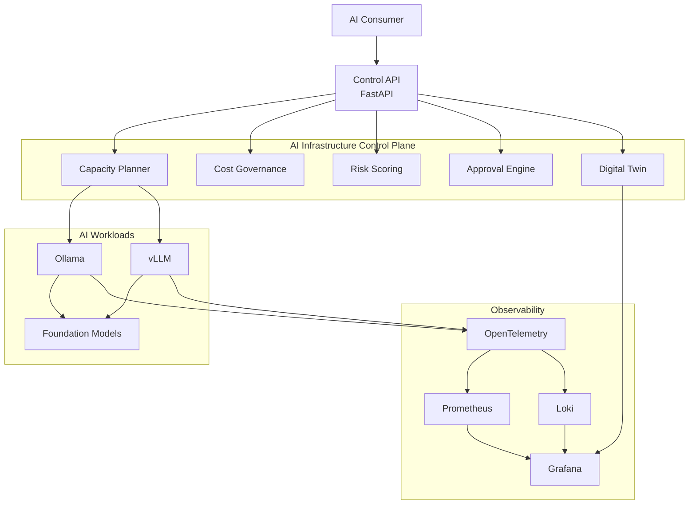
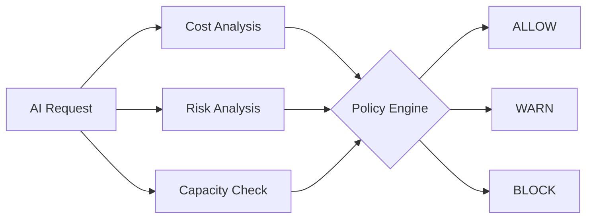
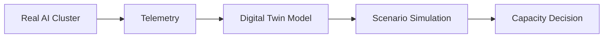
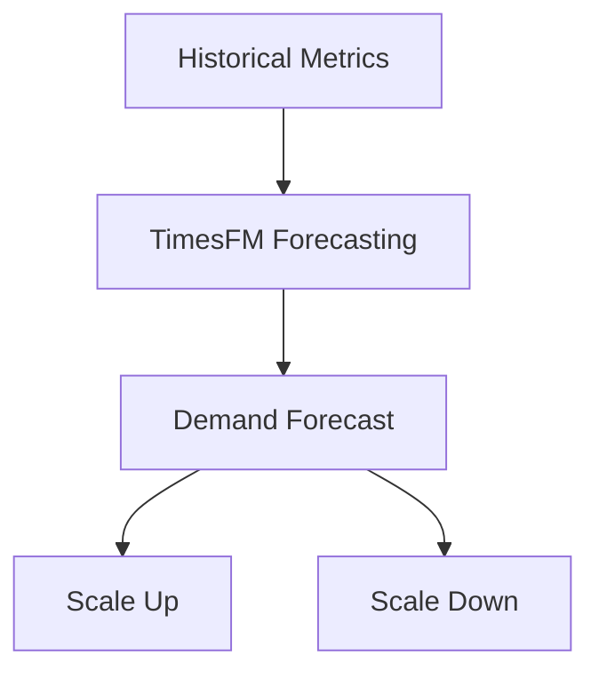
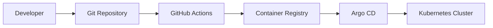

# AI Infrastructure Control Plane

[](https://github.com/justrunme/ai-infra-control-plane/actions/workflows/ci.yml)


> **Product walkthrough** | [Watch the 10-second platform overview](docs/videos/hero-overview.mp4)

A Kubernetes-native platform for operating private AI workloads with observability, forecasting, GitOps delivery, security policy, cost governance, risk scoring, and human approval gates.

This project is intentionally scoped as an AI infrastructure platform, not an agent framework. It focuses on the platform engineering layer around Ollama, vLLM, OpenWebUI, and future private inference backends: deployment, health, latency, capacity, cost, dashboards, forecasting, policy, and operational readiness.

The core workflow is:

```text
AI request
  -> telemetry
  -> cost decision
  -> risk score
  -> approval decision
  -> final verdict
```

Read the portfolio overview in `docs/case-study.md` and the technical system design in `docs/platform-architecture.md`.

## Visual Overview

### Platform Overview



### Governance Flow



### Digital Twin



### Forecast-driven Scaling



### GitOps Delivery



## Scope

- Expose a control API for private AI backend health, latency, capacity, and cost signals.
- Monitor local and Kubernetes-hosted inference backends such as Ollama and vLLM.
- Package the API with Docker and Helm.
- Provision a small VM baseline with Terraform.
- Add GitOps deployment examples through Argo CD.
- Add security and quality gates through GitHub Actions.
- Add observability with Prometheus, Grafana, and future log signals.
- Explore experimental forecasting for latency, load, capacity, and cost signals.
- Evaluate AI governance decisions through cost controls, risk scoring, and approval gates.
- Grow through weekly issues and pull requests instead of empty commits.

## Repository Layout

```text
apps/
  control-api/        FastAPI service with health and model status endpoints
infra/
  helm/               Kubernetes packaging
  terraform/          Cloud bootstrap modules
    k3s-bootstrap/    Example Hetzner VM bootstrap with cloud-init and k3s
observability/
  grafana/            Dashboards and metrics notes
  loki/               Loki and Promtail logging examples
  otel-genai/         OpenTelemetry GenAI telemetry prototype
forecasting/
  timesfm/            Experimental capacity forecasting prototype
experiments/
  inference-autoscaling/ Forecast-driven inference scaling recommendations
governance/
  cost/               AI cost governance policy engine
  risk/               AI request risk scoring engine
  approval/           Human approval workflow prototype
  pipeline/           End-to-end AI governance decision pipeline
security/
  trivy/              Container and IaC scan configuration
  opa/                Kubernetes policy gates for rendered manifests
docs/
  architecture.md     System design notes
  case-study.md       Portfolio case study and demo flow
  digital-twin.md     AI infrastructure topology model
  platform-architecture.md Technical platform architecture
```

## Local Development

```sh
cd apps/control-api
python3.12 -m venv .venv
. .venv/bin/activate
pip install -r requirements.txt
uvicorn app.main:app --reload
```

Run tests:

```sh
make venv
make test
```

The project targets Python 3.12 for local development and CI.

Run the portfolio demo:

```sh
make demo
```

The demo prints the key control API endpoints and runs the end-to-end governance pipeline from `governance/pipeline/sample_requests.csv`.

## Control API

The control API exposes operator-facing signals for private AI infrastructure:

- `GET /health` - operator-facing service health.
- `GET /healthz` - Kubernetes-compatible health check.
- `GET /models` - configured model backends and status.
- `GET /metrics` - Prometheus-compatible text metrics.
- `GET /capacity` - aggregate model serving capacity.
- `GET /cost` - estimated hourly, daily, and monthly cost.
- `GET /summary` - compact status for dashboards and demos.

### Ollama Backend Probe

Set `OLLAMA_BASE_URL` to point the control API at an Ollama backend:

```sh
export OLLAMA_BASE_URL=http://localhost:11434
```

The API exposes:

- `GET /backends/ollama/health` - backend reachability and status.
- `GET /backends/ollama/models` - model names returned by Ollama `/api/tags`.
- `GET /backends/ollama/latency` - lightweight latency measurement for `/api/tags`.

### Prometheus Metrics

`GET /metrics` exposes Prometheus-compatible metrics for request traffic, backend health, model inventory, capacity, and estimated cost.

Core metrics:

- `ai_control_http_requests_total`
- `ai_control_http_request_latency_ms`
- `ai_control_backend_up`
- `ai_control_backend_latency_ms`
- `ai_control_model_available`
- `ai_control_capacity_available`
- `ai_control_estimated_hourly_cost_usd`

### AI Infrastructure Digital Twin

`GET /topology` exposes a live platform graph for private AI infrastructure components, dependencies, health, telemetry, and operational signals. See `docs/digital-twin.md`.

### AI Cost Governance

`governance/cost` evaluates model usage, team budgets, token spend, and forecasted monthly cost into `allow`, `warn`, or `block` decisions.

### AI Approval Workflow

`governance/approval` evaluates high-risk AI platform requests into `allow`, `approval_required`, or `block` decisions for human approval gates.

### AI Governance Layer

`governance/cost`, `governance/risk`, and `governance/approval` model cost control, risk scoring, and human approval gates for private AI infrastructure.

`governance/pipeline` connects those signals into an end-to-end decision flow: request telemetry, cost decision, risk score, approval decision, and final verdict.

Run the demo pipeline:

```sh
python3.12 governance/pipeline/run_pipeline.py \
  --requests governance/pipeline/sample_requests.csv
```

## Portfolio Docs

- `docs/case-study.md` explains the problem, architecture, capabilities, governance pipeline, observability, forecasting, GitOps, security, and demo flow.
- `docs/platform-architecture.md` describes the system boundary, logical layers, control API, governance architecture, delivery path, and extension points.

## First Backlog

- Add vLLM backend probes.
- Add OpenWebUI service health checks.
- Add a Grafana dashboard for request latency and model availability.
- Add Argo CD application manifests.
- Add horizontal pod autoscaling based on CPU and request latency.
- Add Loki log collection examples.
- Add OPA policy checks for Kubernetes manifests.
- Add Terraform examples for Hetzner and local k3s bootstrap.
