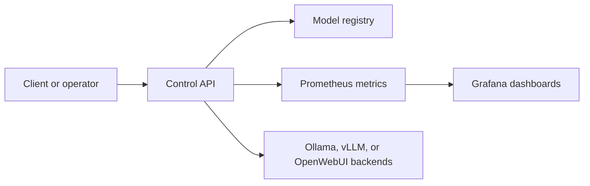

# Architecture

AI Infrastructure Control Plane is a Kubernetes-native platform shell around private AI inference workloads.

It is not an agent runtime or an agent orchestration framework. The system does not try to replace LangGraph, CrewAI, OpenAI Agents SDK, or other workflow engines. Its job is to operate the infrastructure those services may depend on: model serving, health, latency, capacity, cost, deployment, observability, and security.

## Components

- **Control API**: exposes health, model status, capacity, and cost signals.
- **Inference backends**: adapters for Ollama, future vLLM, OpenWebUI, and managed endpoints.
- **Kubernetes package**: Helm chart for deploying the API and later backend workers.
- **Infrastructure modules**: Terraform modules for bootstrap compute and cluster prerequisites.
- **Observability**: Prometheus-friendly metrics and Grafana dashboards.
- **Security**: Trivy scans for containers and infrastructure code.
- **GitOps**: future Argo CD manifests for repeatable deployment.

## Request Flow

## Roadmap

1. Add backend probes for Ollama, vLLM, and OpenWebUI.
2. Expose Prometheus metrics for latency, health, capacity, and cost.
3. Add Grafana dashboards for model operations.
4. Add Argo CD manifests for GitOps deployment.
5. Add Loki log collection examples.
6. Add autoscaling examples for Kubernetes.
7. Add OPA policy checks for Kubernetes manifests.
