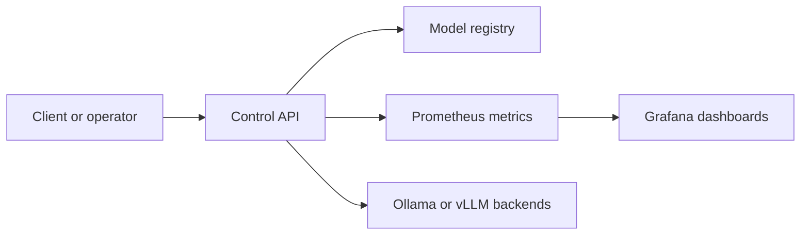

# Architecture

AI Infrastructure Control Plane is a small platform shell around private AI inference workloads.

## Components

- **Control API**: exposes health, model status, capacity, and cost signals.
- **Inference backends**: future adapters for vLLM, Ollama, and managed endpoints.
- **Kubernetes package**: Helm chart for deploying the API and later backend workers.
- **Infrastructure modules**: Terraform modules for bootstrap compute and cluster prerequisites.
- **Observability**: Prometheus-friendly metrics and Grafana dashboards.
- **Security**: Trivy scans for containers and infrastructure code.

## Request Flow

## Roadmap

1. Add backend probes for Ollama and vLLM.
2. Add Prometheus metrics for latency, health, and capacity.
3. Add Grafana dashboard JSON.
4. Add Argo CD manifests.
5. Add autoscaling examples for Kubernetes.

