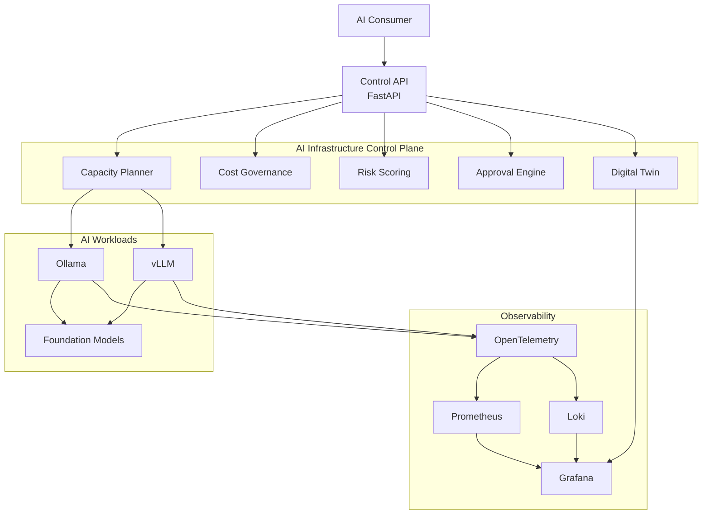

# Architecture

AI Infrastructure Control Plane is a Kubernetes-native platform shell around private AI inference workloads.

It is not an agent runtime or an agent orchestration framework. The system does not try to replace LangGraph, CrewAI, OpenAI Agents SDK, or other workflow engines. Its job is to operate the infrastructure those services may depend on: model serving, health, latency, capacity, cost, deployment, observability, and security.

## Reference Architecture

## Components

- **Control API**: exposes health, model status, capacity, and cost signals.
- **Inference backends**: adapters for Ollama, future vLLM, OpenWebUI, and managed endpoints.
- **Kubernetes package**: Helm chart for deploying the API and later backend workers.
- **Infrastructure modules**: Terraform modules for bootstrap compute and cluster prerequisites.
- **Observability**: Prometheus metrics, Grafana dashboards, Loki logs, and OpenTelemetry GenAI telemetry prototype.
- **Planning**: TimesFM forecasting and forecast-driven autoscaling recommendations.
- **Security**: Trivy scans and OPA policy checks for rendered Kubernetes manifests.
- **Governance**: cost decisions, risk scoring, approval workflow, and end-to-end governance pipeline.
- **GitOps**: Argo CD manifests and Helm packaging for repeatable deployment.
