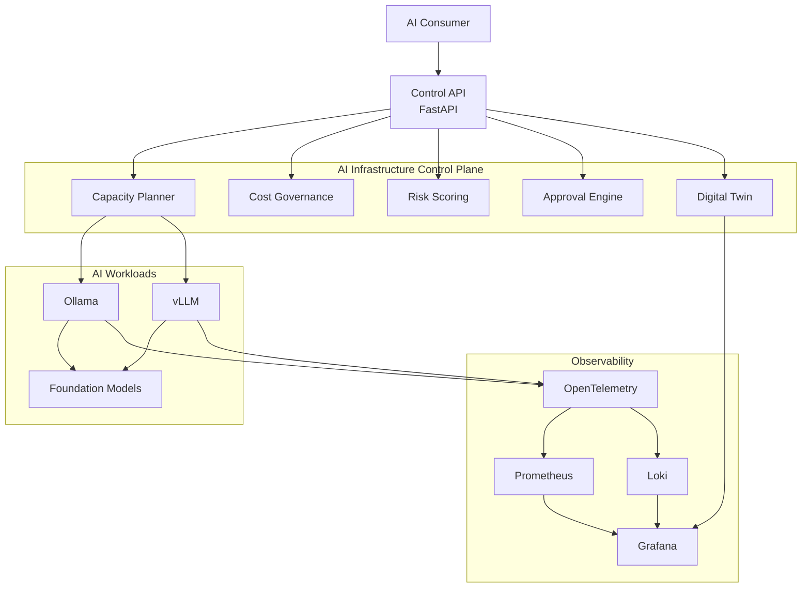
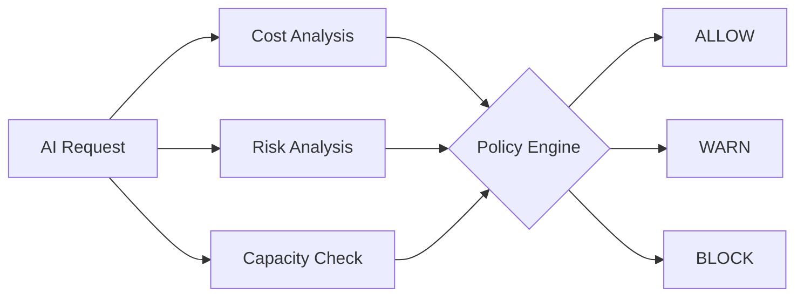
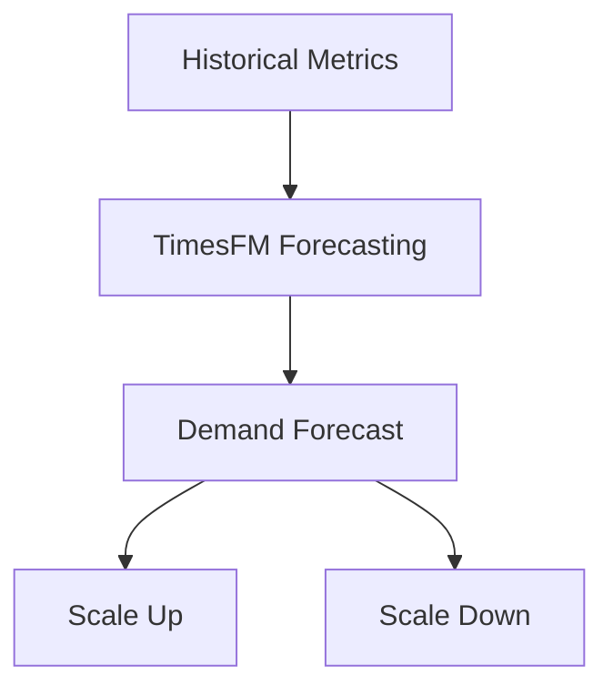
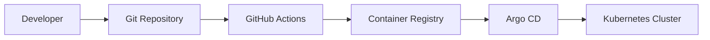

# Portfolio Case Study

## Problem

Private AI adoption creates a platform engineering problem before it becomes an application problem. Teams need to run local or self-hosted model workloads, but they also need operational controls around availability, latency, capacity, cost, security, and change approval.

Common gaps:

- model backends are deployed without a shared operational view;
- latency, token usage, and cost are hard to connect to infrastructure decisions;
- forecasting and autoscaling are treated separately from observability;
- GitOps and policy checks exist, but are not tied to AI-specific risk;
- expensive or sensitive model actions often lack a clear approval workflow.

This project models a private AI platform control plane that connects those concerns into one Kubernetes-native operating layer.

## Architecture

The platform is organized around a control API and a set of infrastructure, observability, governance, and deployment modules.



## Capabilities

- FastAPI control API for health, model inventory, capacity, cost, metrics, and topology.
- Ollama backend probes for health, model listing, and latency.
- Prometheus metrics for backend health, request latency, model availability, capacity, and estimated cost.
- Grafana dashboards for latency, availability, cost, logs, and topology context.
- Loki and Promtail examples for log collection.
- Argo CD application manifest for GitOps deployment.
- Helm chart with autoscaling support.
- Terraform k3s bootstrap example for end-to-end infrastructure setup.
- TimesFM forecasting prototype for latency, traffic, capacity, and cost planning.
- Forecast-driven inference autoscaling simulator.
- OpenTelemetry GenAI telemetry prototype.
- Trivy and OPA policy checks for security and deployment safety.

## Governance Pipeline

> **Video walkthrough** | [Watch the 10-second governance decision flow](videos/governance-pipeline.mp4)

The strongest part of the project is the AI governance layer:



The pipeline combines:

- `governance/cost` for model usage, team budget, token spend, hourly cost, and monthly forecast decisions;
- `governance/risk` for 0-100 risk scoring from provider, namespace, token volume, cost forecast, sensitive data, tool access, write permission, deploy permission, and ownership signals;
- `governance/approval` for human approval gates around production, external providers, high-risk actions, and hard policy violations;
- `governance/pipeline` for the end-to-end verdict.

Example verdicts:

- `allow` for low-risk local or development usage;
- `approval_required` for valid but high-impact production or expensive requests;
- `block` for forbidden models, missing owners, unsupported teams, or hard cost policy violations.

## Observability

The platform exposes infrastructure and AI-specific operational signals:

- backend availability;
- request latency;
- backend latency;
- model availability;
- available capacity;
- estimated hourly cost;
- logs through Loki;
- topology context through the digital twin endpoint.

This makes model operations visible as a platform concern instead of an isolated application metric.

## Forecasting

Forecasting is represented by two prototypes:



- `forecasting/timesfm` for experimental time-series forecasting of latency, request rate, capacity, and estimated hourly cost;
- `experiments/inference-autoscaling` for forecast-driven scaling recommendations before private inference workloads hit limits.

The goal is not to claim production autoscaling. The goal is to show how observability can feed planning decisions before saturation happens.

## GitOps

The GitOps path is intentionally simple and reviewable:



The repository keeps apply steps manual and review-oriented. This matches how platform teams normally introduce new infrastructure capabilities safely.

## Security

Security is handled at several layers:

- Trivy filesystem scan in CI;
- OPA and Conftest checks against rendered Kubernetes manifests;
- policies for privileged containers, latest image tags, missing resources, non-root execution, and read-only root filesystem recommendations;
- governance decisions for high-risk AI operations before execution.

## Demo Flow

1. Start the control API locally and inspect `/health`, `/models`, `/capacity`, `/cost`, `/metrics`, and `/topology`.
2. Run the governance pipeline:

   ```sh
   python3.12 governance/pipeline/run_pipeline.py \
     --requests governance/pipeline/sample_requests.csv
   ```

3. Inspect `governance/pipeline/results/example_decisions.json`.
4. Render the Helm chart and test it with OPA:

   ```sh
   helm template ai-control-plane infra/helm/ai-control-plane \
     | conftest test - --policy security/opa/policies
   ```

5. Review the Grafana dashboards and GitOps manifests to see how operations, observability, deployment, and governance fit together.

## Outcome

The repository demonstrates a practical AI platform architecture: not an agent framework, and not a toy API, but an infrastructure control plane for operating private AI workloads with observability, forecasting, GitOps, security policy, cost governance, risk scoring, and approval gates.
