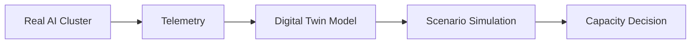

# AI Infrastructure Digital Twin

The AI Infrastructure Digital Twin is a live topology model of private AI platform components, their dependencies, health, telemetry, and operational signals.

It is exposed by the control API:

```sh
curl http://localhost:8080/topology
```

## Purpose

Traditional infrastructure dashboards show isolated metrics. The digital twin adds the dependency graph around private AI workloads:

- where model traffic enters the platform
- which inference backends are connected
- which observability systems collect and visualize signals
- which GitOps and packaging layers deploy the platform
- which forecasting and policy layers influence operations

## Topology Model

The `GET /topology` response has three main sections:

- `nodes` - platform components such as the control API, Ollama, vLLM, Grafana, Loki, Argo CD, k3s, forecasting, and OPA.
- `edges` - dependency relationships such as probes, scrapes, visualizes, deploys, packages, forecasts, and enforces.
- `signals` - per-node operational signals such as capacity, estimated cost, scrape target, retention, autoscaling, and predicted saturation.

Example node:

```json
{
  "id": "control-api",
  "label": "Control API",
  "kind": "api",
  "health": "healthy",
  "signals": [
    {
      "name": "capacity",
      "value": 320,
      "unit": "tokens_per_second",
      "description": "Aggregate serving capacity."
    }
  ]
}
```

Example edge:

```json
{
  "source": "prometheus",
  "target": "control-api",
  "relationship": "scrapes"
}
```

## Platform Graph



## Current Status

The first version is a deterministic topology model backed by the current repository capabilities. Future iterations can replace static health with live probes:

- Ollama and vLLM backend status
- Prometheus scrape health
- Grafana dashboard health
- Loki ingestion status
- Argo CD sync and health status
- k3s node readiness
- forecasted saturation from the autoscaling simulator
- policy gate pass/fail state

## Grafana

Import `observability/grafana/dashboards/topology-overview.json` for a first overview dashboard. It combines topology context with existing Prometheus metrics for backend health, capacity, request rate, and cost.
