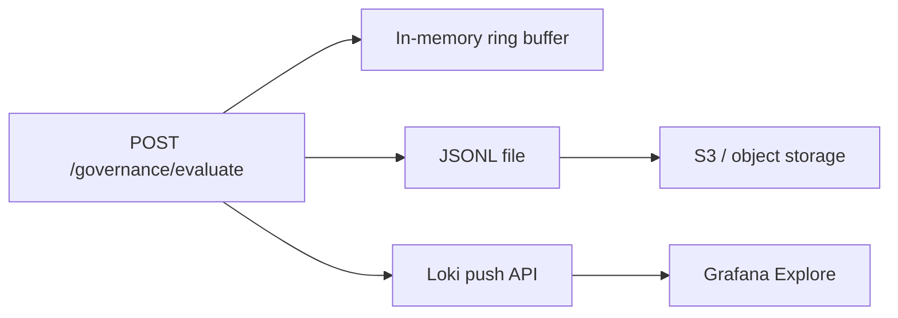

# Persistent audit trail

Production hardening for governance audit events: append-only JSONL on disk and optional push to Grafana Loki.

## Architecture



Every governance evaluation still lands in the in-memory store (`GET /audit/events`). When sinks are configured, the same `AuditEvent` is also persisted durably.

## JSONL file sink

Set `AUDIT_JSONL_PATH` to an append-only file inside a writable volume:

```yaml
env:
  - name: AUDIT_JSONL_PATH
    value: /var/log/ai-control-plane/audit.jsonl
volumeMounts:
  - name: audit-logs
    mountPath: /var/log/ai-control-plane
volumes:
  - name: audit-logs
    emptyDir: {}
```

The Helm chart enables this by default (`audit.jsonlEnabled: true`) with an `emptyDir` mount compatible with `readOnlyRootFilesystem`.

### Shipping to S3

JSONL is the portable interchange format. Ship files to S3 with:

- **Fluent Bit / Vector** tailing `audit.jsonl` and uploading with SSE-KMS
- **Loki** + `object_store: s3` for long-term retention in Grafana Cloud or self-hosted Loki
- **Sidecar** syncing the volume to `s3://audit-bucket/ai-control-plane/` on rotation

WORM buckets and lifecycle policies (e.g. Glacier after 90 days) satisfy compliance retention without changing the API.

## Loki push sink

Enable remote push when a Loki gateway is reachable from the pod:

| Variable | Purpose |
| --- | --- |
| `AUDIT_LOKI_ENABLED` | `true` / `1` to activate |
| `AUDIT_LOKI_URL` | Base URL, e.g. `http://loki.monitoring.svc:3100` |
| `AUDIT_LOKI_TIMEOUT_SECONDS` | Push timeout (default `2.0`) |

Streams are labeled with `app`, `event_type`, `team`, and `verdict` for LogQL dashboards:

```logql
{app="ai-control-plane", verdict="block"} | json
```

Push failures are counted but do not block governance evaluation (fail-open on sink errors).

## Status API

```bash
curl -sS http://127.0.0.1:8091/audit/status
```

Returns enabled sinks, paths, and counters (`jsonl_written`, `loki_pushed`, `loki_errors`).

## Related

- [Identity and audit trail](identity-audit.md)
- Helm values: `audit.*` in `infra/helm/ai-control-plane/values.yaml`
