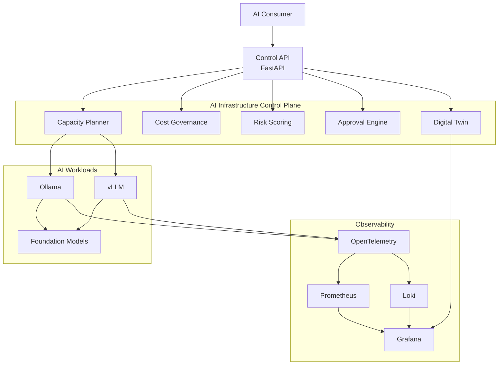
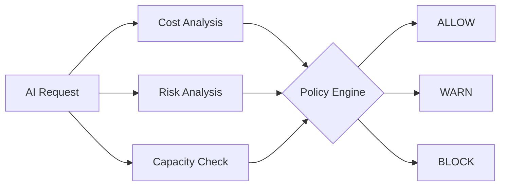
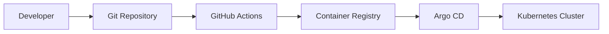

# Platform Architecture

## System Boundary

AI Infrastructure Control Plane operates the platform layer around private AI workloads. It does not implement prompt orchestration, agent memory, or multi-agent workflows. Its responsibility is infrastructure operation:

- deploy model-facing services;
- observe health, latency, capacity, logs, and cost;
- forecast capacity pressure;
- apply GitOps and security controls;
- evaluate governance decisions before high-risk AI operations.

## Platform Reference Architecture

## Logical Layers

- Serving layer: Ollama, vLLM, OpenWebUI, and future model gateway integrations.
- Control plane: FastAPI control API, topology model, metrics, capacity, and cost signals.
- Observability layer: OpenTelemetry GenAI signals, Prometheus, Grafana, and Loki.
- Planning layer: TimesFM forecasting and forecast-driven autoscaling experiments.
- Governance layer: cost governance, risk scoring, approval workflow, and decision pipeline.
- Delivery layer: Terraform bootstrap, Argo CD, Helm, OPA policy gates, and Trivy scans.

## Control API

The control API is the operator-facing interface for platform state:

- `/health` and `/healthz` for service health;
- `/models` for configured model backend inventory;
- `/backends/ollama/health`, `/models`, and `/latency` for Ollama probes;
- `/metrics` for Prometheus-compatible metrics;
- `/capacity` for aggregate serving capacity;
- `/cost` for estimated hourly, daily, and monthly cost;
- `/summary` for dashboard-oriented status;
- `/topology` for the digital twin graph.

## Observability Architecture

The observability layer is built around operational signals that matter for private inference:

- backend availability;
- model availability;
- request and backend latency;
- capacity available;
- estimated hourly cost;
- logs with Loki and Promtail examples;
- topology context through Grafana.

OpenTelemetry GenAI telemetry is included as a prototype for model name, token usage, latency, tool calls, and estimated cost attributes without storing prompt or response content.

## Forecasting And Capacity Planning

> **Video walkthrough** | Click the animated preview to watch the full 10-second forecast-driven scaling walkthrough.

Forecasting is intentionally isolated from production deployment paths:

- TimesFM prototype forecasts latency, request rate, capacity, and hourly cost from sample metrics;
- inference autoscaling simulator turns forecasted demand into replica recommendations;
- Helm autoscaling remains conservative and Kubernetes-native.

This separation keeps the production chart understandable while showing where predictive operations can evolve.

## Digital Twin

> **Video walkthrough** | Click the animated preview to watch the full 10-second digital twin walkthrough.

The digital twin represents a live topology model for private AI platform components, their dependencies, health, telemetry, and operational signals. It provides the context needed to evaluate capacity planning scenarios before applying a change to the real AI cluster.

## Governance Architecture

Governance is modeled as a staged decision pipeline.

The stages are:

- Cost governance: `allow`, `warn`, or `block` based on team budget, model approval, hourly cost, and forecasted monthly cost.
- Risk scoring: `0-100` score with `low`, `medium`, `high`, or `critical` level.
- Approval workflow: `allow`, `approval_required`, or `block` based on production usage, external providers, high-risk actions, ownership, and policy results.
- Pipeline verdict: final `allow`, `approval_required`, or `block`.

## GitOps And Deployment

The delivery path is designed for reviewable infrastructure changes:

The repository includes a Terraform k3s bootstrap example, Argo CD application manifest, Helm chart, and policy checks against rendered Kubernetes manifests.

## Security Controls

Security controls are split into CI, manifest, and AI-operation layers:

- Trivy scans repository files in GitHub Actions;
- OPA policies validate rendered Kubernetes manifests;
- Helm chart defaults avoid obvious unsafe deployment patterns;
- governance modules block or require review for unsafe AI operations.

## Extension Points

The next realistic extensions are:

- vLLM backend probe;
- OpenWebUI deployment notes;
- model gateway enforcement point;
- live Prometheus query integration for governance inputs;
- GitHub environment or Argo CD approval integration;
- screenshots or exported Grafana panels for the portfolio README.
