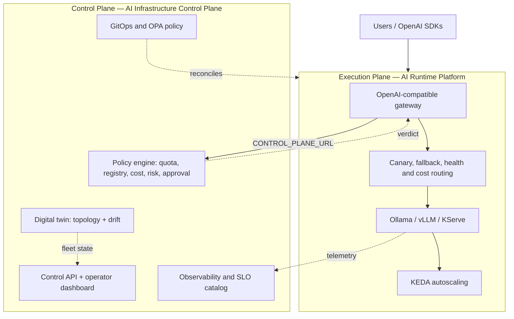

# AI Infrastructure OS

**AI Infrastructure Control Plane** is the open-source operating layer for private AI platforms: policy, cost, capacity, observability, and fleet operations on Kubernetes.

**[AI Runtime Platform](https://github.com/justrunme/ai-runtime-platform)** is the reference **Execution Plane** — the OpenAI-compatible gateway that enforces control-plane verdicts at the inference boundary.

Read the full [product roadmap](product-roadmap.md) for module maturity and enterprise epics.

## Platform layers

```text
AI Infrastructure OS
├── Execution Plane       → ai-runtime-platform
├── Control Plane         → ai-infra-control-plane (this repo)
├── Policy Engine         → governance/ + OPA
├── Cost & Chargeback     → cost + quota + forecasting
├── Fleet & Topology      → topology + drift
├── Capacity Planner      → experiments/
├── Observability & SLO   → observability/slo/
└── GitOps & Security     → infra/ + security/
```

## Architecture



## Responsibilities

### Execution Plane (`ai-runtime-platform`)

- OpenAI-compatible API gateway with routing intelligence
- Canary, shadow, fallback, health-aware, and cost-aware selection
- Optional governance enforcement via `CONTROL_PLANE_URL`
- Tenant attribution prototype (`TENANT_ATTRIBUTION_ENABLED`)
- vLLM, KServe, KEDA, OpenTelemetry

### Control Plane (`ai-infra-control-plane`)

- Operator dashboard, governance playground, inventory drift
- Policy pipeline: tenant quota → model registry → cost → risk → approval
- Digital twin topology and backend probes
- Forecasting and capacity experiments
- Helm, Terraform, OPA, SLO catalog, chargeback dashboards

## Cross-repo integration

When the runtime gateway sets `CONTROL_PLANE_URL`, every chat completion is evaluated by `POST /governance/evaluate` before upstream inference. See [runtime enforcement integration](runtime-enforcement.md).

## Chargeback and FinOps

Runtime emits `gateway_tenant_requests_total` and `gateway_tenant_tokens_total`. The control plane exposes governance verdict metrics. Grafana dashboards in `observability/grafana/dashboards/chargeback-attribution.json` combine both for team-level attribution.
