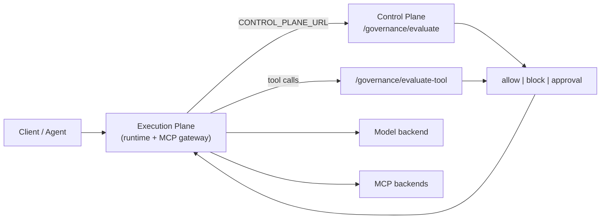

# AI Infrastructure OS — Product Roadmap

**AI Infrastructure OS** is the open-source **operating layer** for enterprise AI on Kubernetes: models, agents, tools, identity, policy, cost, audit, and runtime control — not just inference.

The [AI Runtime Platform](https://github.com/justrunme/ai-runtime-platform) is the reference **Execution Plane** — gateway, MCP proxy, routing, shadow traffic, and GitOps delivery.

## Platform map

```text
AI Infrastructure OS
├── Execution Plane       → ai-runtime-platform (OpenAI gateway, MCP proxy, routing)
├── Control Plane         → ai-infra-control-plane (Control API, dashboard)
├── Policy Engine         → governance/ + OPA + runtime enforcement
├── Tool & Agent Registry → tools.yaml, agents.yaml, MCP governance
├── Prompt Governance     → PII, secrets, injection scan (pre-inference stage)
├── Cost & Chargeback     → cost governance + tenant quota + forecasting
├── Fleet & Topology      → /topology, inventory drift, digital twin
├── Capacity Planner      → experiments/inference-autoscaling
├── Observability & SLO   → observability/slo/, Grafana, OTel
└── GitOps & Security     → infra/helm, Terraform, security/opa
```

## Module maturity (main)

| Module | Location | Maturity | Notes |
| --- | --- | --- | --- |
| Execution Plane | `ai-runtime-platform` | 7/10 | Routing, shadow, governance enforcement |
| Control Plane API | `apps/control-api` | 8/10 | Dashboard, drift, topology, audit API |
| Identity & Audit | `apps/control-api/app/identity_service.py` | 6/10 | JWT/header identity, audit trail |
| Policy Engine | `governance/` + OPA | 7/10 | Policy packs → prompt → quota → registry → cost → risk |
| Model Registry | `governance/registry/` | 7/10 | Digest, attestation, SBOM ref, model cards |
| Tool Registry | `governance/tools/` | 5/10 | MCP tool catalog, action allowlists |
| MCP Gateway | `ai-runtime-platform` `/mcp/*` | 5/10 | Governed tool calls via evaluate-tool |
| Prompt Governance | `governance/prompt-security/` | 5/10 | PII, secrets, injection heuristics |
| Agent Registry | `governance/agents/` | 5/10 | Agent → model + tools + policy binding |
| Intent Engine | `governance/intent/` | 5/10 | NL → agent/model/tools/region plan |
| Cost & Chargeback | cost + quota + tenant metrics | 6/10 | Helm-wired policies, Grafana chargeback |
| Fleet & Topology | `/topology`, `/drift` | 7/10 | Live probes vs desired inventory |
| Platform Demo | `demo/platform/` | 8/10 | `make platform-demo-enterprise` reference stack |

## Decision vs execution



## Agentic epics (2026 focus)

| Epic | Priority | Target | Status |
| --- | --- | --- | --- |
| MCP Gateway + Tool Registry | P0 | runtime + `governance/tools/` | Done |
| Prompt Security | P1 | `governance/prompt-security/` | Done |
| Agent Registry | P2 | `governance/agents/` | Done |
| Model Supply Chain (SBOM) | P3 | `governance/registry/` | Done |
| AI Evaluations (post-response) | P4 | control-api | Done |
| Sovereign AI (region routing) | P5 | policy packs + sovereign | Done |
| Intent Engine | P6 | `governance/intent/` | Done |

## Public narrative

> I am building an open-source **AI Infrastructure OS** — the enterprise operating layer for private AI: govern models, agents, and tools; enforce identity, policy, cost, and audit; run inference and MCP on Kubernetes.

## Related docs

- [MCP Gateway](mcp-gateway.md)
- [Tool Registry](tool-registry.md)
- [Prompt Governance](prompt-governance.md)
- [Agent Registry](agent-registry.md)
- [Sovereign AI](sovereign-ai.md)
- [AI Evaluations](ai-evaluations.md)
- [Intent Engine](intent-engine.md)
- [Portfolio blog outline](portfolio/blog-outline-enterprise-ai-os.md)
- [Demo GIF script](portfolio/demo-gif-script.md)
- [Reference architecture](portfolio/reference-architecture.md)
- [Signed model registry](signed-model-registry.md)
- [Portfolio overview](portfolio-overview.md)
- [Runtime enforcement](runtime-enforcement.md)
- [Policy packs](policy-packs.md)
