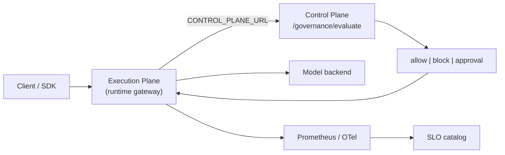

# AI Infrastructure OS — Product Roadmap

**AI Infrastructure Control Plane** is the open-source **operating layer** for private AI platforms on Kubernetes: policy, cost, capacity, observability, and fleet operations.

The [AI Runtime Platform](https://github.com/justrunme/ai-runtime-platform) is the reference **Execution Plane** — not a separate product, but module #1 of the same platform story.

## Platform map

```text
AI Infrastructure OS
├── Execution Plane       → ai-runtime-platform (OpenAI gateway, routing, shadow)
├── Control Plane         → ai-infra-control-plane (Control API, dashboard)
├── Policy Engine         → governance/ + OPA + runtime enforcement
├── Cost & Chargeback     → cost governance + tenant quota + forecasting
├── Fleet & Topology      → /topology, inventory drift, digital twin
├── Capacity Planner      → experiments/inference-autoscaling
├── Observability & SLO   → observability/slo/, Grafana, OTel
└── GitOps & Security     → infra/helm, Terraform, security/opa
```

## Module maturity (main)

| Module | Location | Maturity | Notes |
| --- | --- | --- | --- |
| Execution Plane | `ai-runtime-platform` | 7/10 | Routing, shadow, governance enforcement |
| Control Plane API | `apps/control-api` | 8/10 | Dashboard, drift, topology |
| Policy Engine | `governance/` + OPA | 7/10 | Quota → registry → cost → risk → approval |
| Cost & Chargeback | cost + quota + tenant metrics | 6/10 | Helm-wired policies, Grafana chargeback |
| Fleet & Topology | `/topology`, `/drift` | 7/10 | Live probes vs desired inventory |
| Capacity Planner | `experiments/inference-autoscaling` | 5/10 | Offline forecast → replica recommendation |
| Model Registry | `governance/registry/` | 6/10 | Risk tier, namespace, PII, budget |
| Observability & SLO | `observability/slo/` | 6/10 | Prometheus rules + alert catalog |
| Canary Analysis | `ai-runtime-platform/experiments/canary-analysis` | 5/10 | Promote/hold/rollback from shadow metrics |

## Decision vs execution



## Enterprise epics (inside this repo)

These are **not** new repositories — they extend the flagship:

| Epic | Target | Next slice |
| --- | --- | --- |
| GPU Scheduler | `experiments/gpu-placement/` | Placement scoring prototype |
| AI Chargeback | Grafana + tenant metrics | ✅ chargeback dashboard |
| Capacity closed loop | forecasting + autoscaling | Wire forecast output to HPA hints |
| Incident Copilot | `docs/runbooks/` | Alert → playbook JSON |
| Multi-cloud placement | registry + topology | Cloud/region labels on models |

## Public narrative

> I am building an open-source **AI Infrastructure Control Plane** — the operating system for private AI on Kubernetes: governance enforcement, cost and tenant quotas, SLO catalog, fleet topology, and capacity experiments. The runtime gateway is the reference execution plane.

## Related docs

- [Portfolio overview](portfolio-overview.md)
- [Runtime enforcement](runtime-enforcement.md)
- [Workload identity & quotas](workload-identity-quotas.md)
- [SLO catalog](../observability/slo/README.md)
