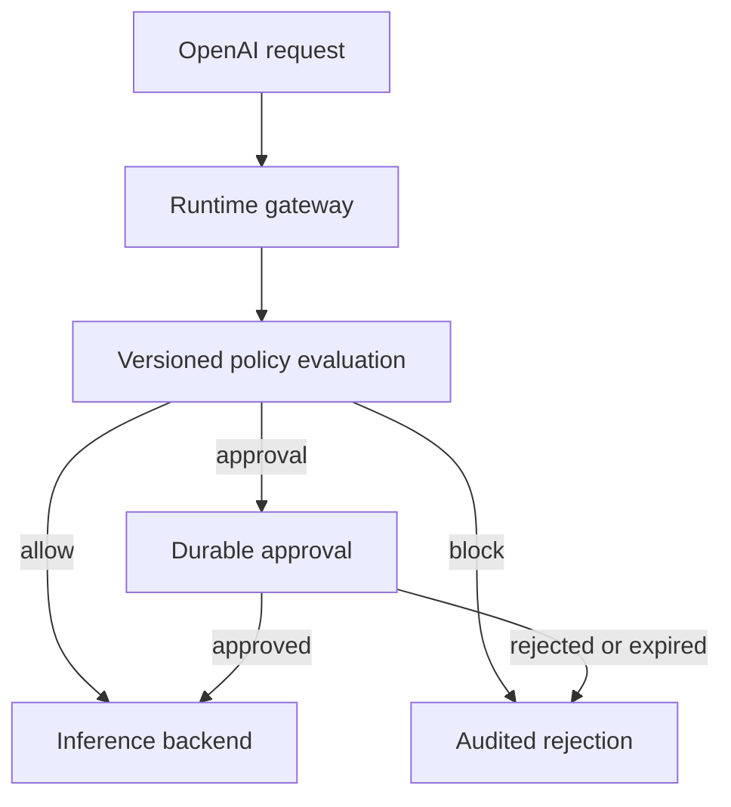

# AI Infrastructure OS — Product Roadmap

**AI Infrastructure OS** is the open-source **operating layer** for enterprise AI on Kubernetes: models, agents, tools, identity, policy, cost, audit, and runtime control — not just inference.

This repository is the **reference Control Plane**. The [AI Runtime Platform](https://github.com/justrunme/ai-runtime-platform) is the reference **Execution Plane**.

## Public positioning

> Kubernetes-native reference control plane for governed private AI inference.  
> Part of the AI Infrastructure OS architecture.

## Status legend

| Status | Meaning |
| --- | --- |
| Production path | Used on the deployable evaluate / enforce path |
| Integrated | Works in the platform demo stack |
| Prototype | Offline, sample-driven, or experimental |
| Design only | Documented intent |

## Module maturity

| Module | Location | Status | Notes |
| --- | --- | --- | --- |
| Execution Plane | `ai-runtime-platform` | Production path | Gateway enforces verdicts |
| Control Plane API | `apps/control-api` | Production path | Dashboard, drift, durable evaluate |
| Policy bundle | `app/policy_bundle.py` | Production path | Digest + reload API |
| Durable decisions / approvals | `app/decision_store.py` | Production path | SQLite default; Postgres optional |
| Identity & Audit | identity + audit + JSONL/Loki | Integrated | JWKS verify opt-in |
| Policy Engine | `governance/` + OPA | Production path | Packs → prompt → quota → registry → cost → risk |
| Model Registry | `governance/registry/` | Integrated | Digest / attestation metadata |
| Tool / Agent / Intent | `governance/tools|agents|intent/` | Prototype | YAML registries + heuristics |
| Prompt Governance | `governance/prompt-security/` | Prototype | Regex heuristics |
| Live Governance Inputs | Redis + Prometheus | Integrated | Demo production overlay |
| Fleet & Topology | `/topology`, `/drift` | Integrated | Live probes; remote clusters static |
| Cost & FinOps | cost + `finops/` | Prototype | Rules + sample CSV |
| Forecasting / capacity | `forecasting/`, `experiments/` | Prototype | Offline simulators |
| Platform Demo | `demo/platform/` | Integrated | Laptop / production / enterprise tiers |

## Golden path (v0.2)

```mermaid
flowchart TD
    A["OpenAI request"] --> B["Runtime gateway"]
    B --> C["Versioned policy evaluation"]
    C -->|allow| D["Inference backend"]
    C -->|block| E["Audited rejection"]
    C -->|approval| F["Durable approval"]
    F -->|approved| D
    F -->|rejected or expired| E
```

Docs: [durable-governance.md](durable-governance.md) · [ADR 0001](adr/0001-durable-governance-store.md)

## Roadmap

| Release | Focus | Status |
| --- | --- | --- |
| v0.1.0 | Enterprise demo + agentic surface | Done |
| v0.2.0 | PolicyBundle, durable decisions/approvals, probe cache | Done |
| v0.3.0 | Router split, Postgres profile, JWKS fail-closed, kind e2e | Done |
| v0.4.0 | Failure injection matrix, governance SLO benchmark + dashboard | Done |
| v0.5.0 | Trust boundary: request-bound one-time approvals, `/livez`/`/readyz`, HA Postgres production profile | Done |
| v0.6.0 | Connection pool, migrations, multi-replica Postgres e2e | Next |
| v0.7.0 | Versioned OpenAPI + breaking-change CI + unified errors | Planned |
| v1.0 | Stable API schema + supported/reference/experimental boundary | Planned |

## Related docs

- [Durable governance](durable-governance.md)
- [Control plane SLOs](slo.md)
- [Failure injection](failure-injection.md)
- [Portfolio overview](portfolio-overview.md)
- [Runtime enforcement](runtime-enforcement.md)
- [Platform architecture](platform-architecture.md)
