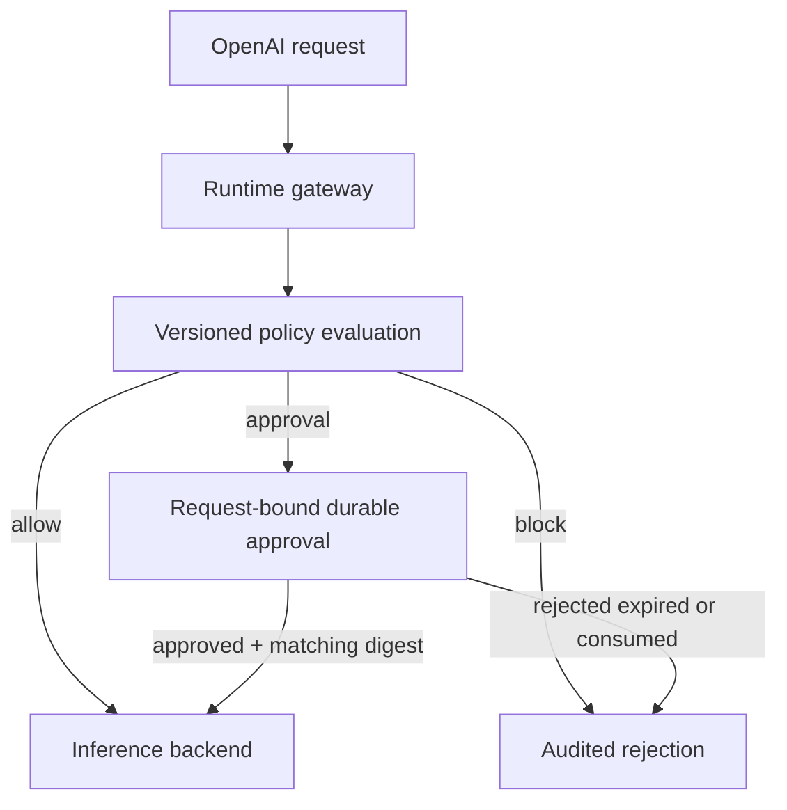

# AI Infrastructure OS — Product Roadmap

**AI Infrastructure OS** is the open-source **operating layer** for enterprise AI on Kubernetes: models, agents, tools, identity, policy, cost, audit, and runtime control — not just inference.

This repository is the **reference Control Plane**. The [AI Runtime Platform](https://github.com/justrunme/ai-runtime-platform) is the reference **Execution Plane**.

## Public positioning

> Kubernetes-native reference control plane for governed private AI inference.  
> Part of the AI Infrastructure OS architecture.

## Status legend

| Status | Meaning |
| --- | --- |
| Production path | Used on the deployable evaluate / enforce path |
| Integrated | Works in the platform demo stack |
| Prototype | Offline, sample-driven, or experimental |
| Design only | Documented intent |

## Module maturity

See [maturity-boundary.md](maturity-boundary.md) for Supported / Reference / Experimental tiers.

## Golden path

```mermaid
flowchart TD
    A["OpenAI request"] --> B["Runtime gateway"]
    B --> C["Versioned policy evaluation"]
    C -->|allow| D["Inference backend"]
    C -->|block| E["Audited rejection"]
    C -->|approval| F["Request-bound durable approval"]
    F -->|approved + matching digest| D
    F -->|rejected expired or consumed| E
```

## Roadmap

| Release | Focus | Status |
| --- | --- | --- |
| v0.1.0 | Enterprise demo + agentic surface | Done |
| v0.2.0 | PolicyBundle, durable decisions/approvals, probe cache | Done |
| v0.3.0 | Router split, Postgres profile, JWKS fail-closed, kind e2e | Done |
| v0.4.0 | Failure injection matrix, governance SLO benchmark + dashboard | Done |
| v0.5.0 | Trust boundary, HA Postgres production profile, readiness | Done |
| v0.6.0 | Connection pool, schema migrations, DB metrics, multi-replica Postgres e2e | Done (rolled into v1.0) |
| v0.7.0 | Frozen OpenAPI, unified errors, pagination, compatibility CI | Done (rolled into v1.0) |
| v1.0.0 | Stable contract + maturity boundary + upgrade guide | Done |
| v1.0.1 | Correct migration ledger + concurrent schema apply | Done |
| v1.1.0 | Transactional Unit of Work, indexes, pagination metadata | Done |
| v1.2.0 | OpenAPI breaking-diff CI, OCI Helm chart distribution | Done |
| v1.3.0 | Retention purge, decision FKs, signed OCI Helm chart | Done |
| v1.4.0 | Tenant isolation, PrometheusRule SLO alerts, drift actions, ADRs | Done |
| v1.5.0 | Signed OCI PolicyBundle + simulate/activate/rollback + CRD | Done |
| v1.6.0 | RemediationProposal closed-loop (detect→approve→PR→verify) | Done |
| v1.7.0 | RBAC + JWT-only tenant + quota failure policy | Done |
| v1.8.0 | Durable agent/tool capability contract | Done |
| v2.0.0 | Stabilize CRD/API + upgrade boundary | This release |

## Related docs

- [Durable governance](durable-governance.md)
- [Control plane SLOs](slo.md)
- [Failure injection](failure-injection.md)
- [API compatibility](api-compatibility.md)
- [Maturity boundary](maturity-boundary.md)
- [Upgrade v0.5 → v1.0](upgrade-v0.5-to-v1.0.md)
- [Upgrade v1.x → v2.0](upgrade-v1-to-v2.0.md)
- [Release verification](release-verification.md)
- [Retention](retention.md)
- [Tenant isolation](tenant-isolation.md)
- [Threat model](threat-model.md)
- [ADRs](adr/README.md)
- [Policy bundles GitOps](policy-bundles-gitops.md)
- [Remediation proposals](remediation-proposals.md)
- [RBAC](rbac.md)
- [Capability contracts](capability-contracts.md)
- [Portfolio overview](portfolio-overview.md)
- [Runtime enforcement](runtime-enforcement.md)
- [Platform architecture](platform-architecture.md)
